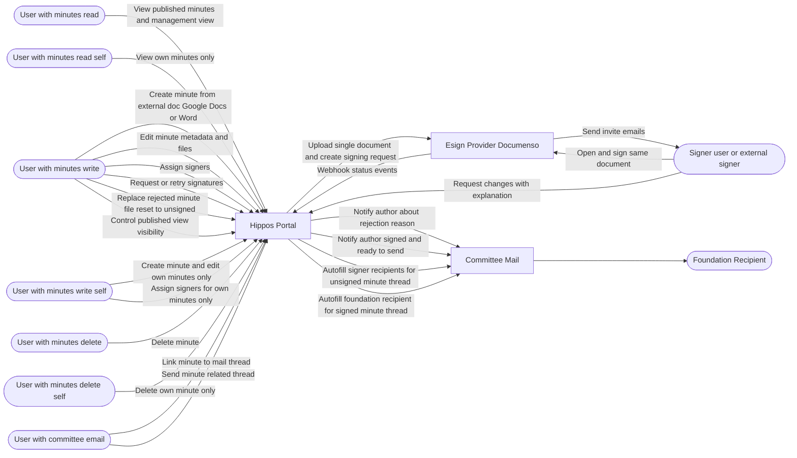
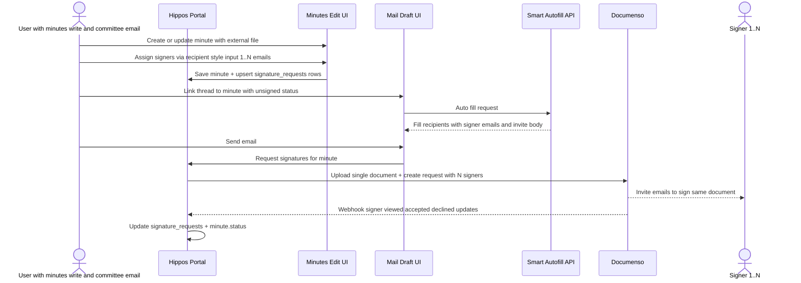
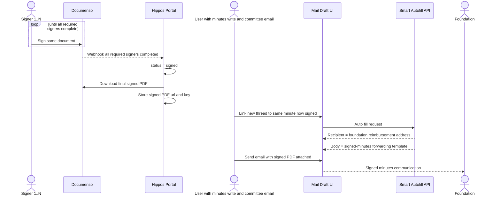
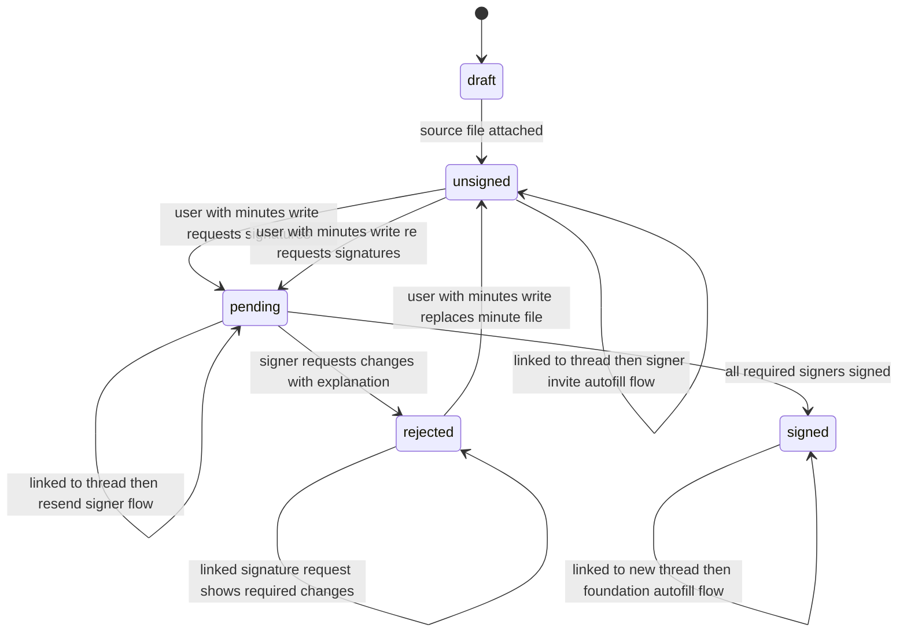
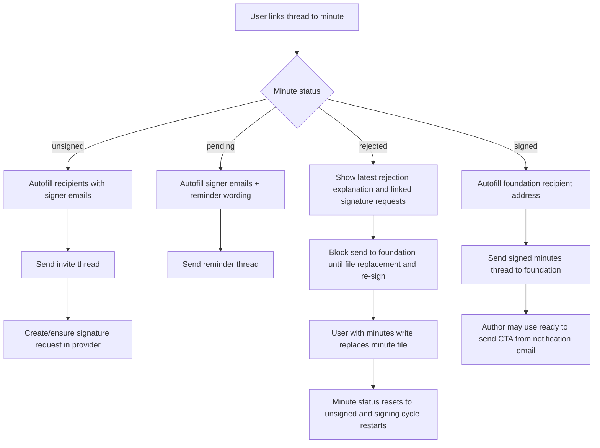
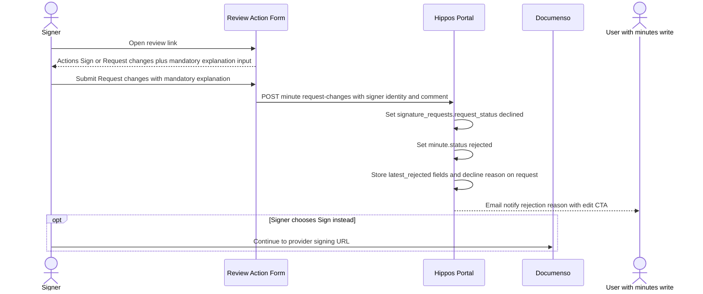
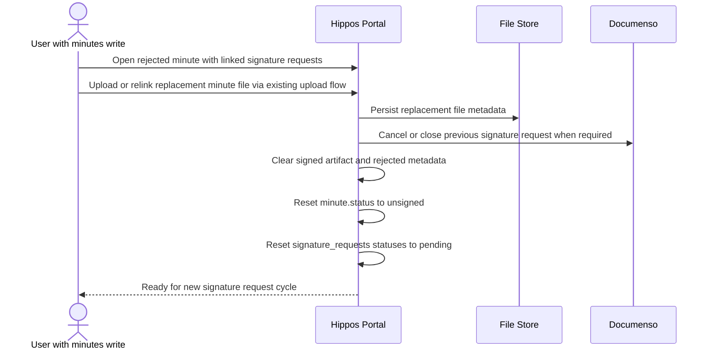

# Minutes Rework Implementation Plan (Check-4)

## Executive Summary

This document defines the concrete implementation plan for reworking minutes with:

1. **Unified status model** replacing the old `draft | active | archived` with `draft | unsigned | pending | signed | rejected`.
2. **Two subroutes**: one showing all minutes (management view for `minutes:write` users), one showing only published/signed documents (public view).
3. **Signer workflow** (assign signers, collect signatures, handle rejections with explanation).
4. **Provider-based signature workflow** using Documenso (self-hosted, open-source e-sign platform).
5. **Email + relationship picker integration** so unsigned minutes trigger signer invites and signed minutes route to foundation recipient flow.
6. **Author notification workflow** so the minute author gets a "ready to send" email when fully signed.
7. **Signer feedback workflow** so rejected minutes always include mandatory explanation.
8. **Signature request entity** so per-signer accept/decline state and mandatory decline reason are first-class and linkable via `entity_relations`.

This plan is designed to fit existing architecture:
- `minute` is already a first-class entity in relationship picker and relation config.
- Mail draft edit already links `minute` + `receipt` + `reimbursement`.
- Smart autofill already reads linked minute/receipt/reimbursement context.
- `entity_relations` table already provides entity linking — no custom join keys needed.

---

## 1. Scope and Non-Goals

### 1.1 In Scope

- Two minutes subroutes: management view (all statuses) and published view (signed/active only).
- Signer assignment UI + multi-signer status workflow.
- E-sign provider integration (request creation, invite sending, webhook status sync).
- Integration with existing relationship picker and smart autofill.
- Send-time behavior split by minute status:
  - unsigned/pending minute -> invite signers
  - signed minute -> route to foundation recipient address.

### 1.2 Not in Scope (Phase 1-2)

- Replacing Google Drive as source of truth for binary files.
- Building a custom cryptographic signature engine in our backend.

### 1.3 Storage and Upload Invariant

- External authoring does not change file storage architecture.
- Uploading/relinking minute files must continue using the same blob/file pipeline already used by the app.
- No new storage provider, no new upload API contract, and no blob schema changes are introduced by this check.

---

## 2. RBAC Design

### 2.1 Existing Permissions (reuse)

- `minutes:read`
- `minutes:write`
- `minutes:delete`
- `minutes:export`
- `minutes:guide`
- `committee:email`

Note: `minutes:export` and `minutes:guide` are unaffected by this check.

### 2.2 New Permissions (required)

The following self-scoped permissions must be **created** in `app/lib/permissions.ts`:

- `minutes:read:self` — read/list only own minutes (`minutes.created_by == actorUserId`).
- `minutes:write:self` — create minutes and edit only own minutes.
- `minutes:delete:self` — delete only own minute records.

### 2.3 Permission Usage

Use permissions as follows:

- `minutes:read` — read/list all minute records regardless of status.
- `minutes:read:self` — read/list only own minutes (`minutes.created_by == actorUserId`).
- `minutes:write` — create and edit all minutes, assign signers, request/retry signatures, replace source files, control which minutes appear in published view.
- `minutes:write:self` — create minutes and edit only own minutes.
- `minutes:delete` — delete all minute records.
- `minutes:delete:self` — delete only own minute records.
- `committee:email` — send and manage committee mail flows linked to minutes.

Ownership rule:

- Self-scoped permission checks are always evaluated against `minutes.created_by` (or equivalent canonical author field).
- If user has both global and self variants, global permission takes precedence.

### 2.4 `minutes:update` Removal

`minutes:update` must be fully removed from the codebase and replaced with `minutes:write`.

All known usages to update:

- `app/lib/permissions.ts` — remove `minutes:update` definition
- `app/routes/minutes/_index.tsx` — replace `minutes:update` with `minutes:write`
- `app/routes/minutes/$minuteId/_index.tsx` — replace `minutes:update` with `minutes:write`
- `app/routes/minutes/$minuteId/edit/_index.tsx` — replace `minutes:update` with `minutes:write` (both loader and action)
- `app/lib/files/delete-temp-action.server.ts` — remove `minutes:update` from minute permission array
- `app/lib/files/upload-token-action.server.ts` — remove `minutes:update` from minute permission array
- `app/lib/files/upload-temp-action.server.ts` — remove `minutes:update` from minute permission array
- `app/routes/api/relationship/analyze/_index.tsx` — replace `minutes:update` with `minutes:write`
- Role seed/default role assignment files — replace all `minutes:update` grants with `minutes:write`

Do not ship with dual checks; final state should have no runtime dependency on `minutes:update`.

### 2.5 Required Capability Bundle for Editing Workflow

For end-to-end editing workflow (create minute, assign signers, link/send mail thread), user should have:

- `minutes:read`
- `minutes:write`
- `committee:email`

Own-minutes-only alternative:

- `minutes:read:self`
- `minutes:write:self`
- `committee:email`

For delete operations, user should also have:

- `minutes:delete`

Own-minutes-only delete alternative:

- `minutes:delete:self`

---

## 3. Data Model Changes

### 3.1 Status Model Change

Replace the existing `MinuteStatus` type:

**Before:** `draft | active | archived`
**After:** `draft | unsigned | pending | signed | rejected`

Status meanings:
- `draft` — minute created but no file attached or not ready for signing.
- `unsigned` — minute has a source file attached but signatures have not been requested yet.
- `pending` — signatures have been requested and are awaiting completion.
- `signed` — all required signers have signed the document.
- `rejected` — a signer has requested changes with mandatory explanation.

Migration must update existing rows:
- `draft` -> `draft` (no change)
- `active` -> `unsigned` (safe default since existing minutes had no signature workflow)
- `archived` -> `draft` (archived concept removed; if needed later, reintroduce as separate flag)

### 3.2 Migration 1: Minutes Status + Signature Fields

Create migration: `drizzle/0034_update_minutes_status_and_signature_fields.sql`

Alter `minutes.status` column to use new enum values (with data migration for existing rows).

Add columns to `minutes`:

- `signature_provider` text null (e.g. `documenso`)
- `signature_request_id` text null (provider envelope/request id)
- `signature_signed_file_url` text null
- `signature_signed_file_key` text null
- `signature_completed_at` timestamp null
- `signature_completed_by_count` integer not null default 0
- `signature_required_count` integer not null default 0
- `latest_rejected_reason` text null
- `latest_rejected_at` timestamp null
- `latest_rejected_by_email` text null

Indexes:

- `minutes_status_idx` on (`status`)
- `minutes_signature_request_id_idx` on (`signature_request_id`)

### 3.3 Migration 2: Signature Audit History (recommended)

Create migration: `drizzle/0035_add_minute_signature_history.sql`

Create table `minute_signature_history`:

- `id` uuid pk
- `minute_id` uuid not null references minutes(id) on delete cascade
- `action` text not null (`assigned | signed | rejected | unassigned | file_replaced`)
- `actor_user_id` uuid null references users(id)
- `signer_user_id` uuid null references users(id)
- `comment` text null
- `metadata` text null (JSON)
- `created_at` timestamp not null default now()

### 3.4 Migration 3: Signature Requests (required)

Create migration: `drizzle/0036_add_signature_requests.sql`

Create table `signature_requests`:

- `id` uuid pk
- `minute_id` uuid not null references minutes(id) on delete cascade
- `request_email` text not null
- `request_user_id` uuid null references users(id)
- `request_name` text null
- `request_status` text not null default `'pending'` (`pending | viewed | accepted | declined`)
- `provider_request_id` text null
- `provider_recipient_id` text null
- `accepted_at` timestamp null
- `declined_at` timestamp null
- `decline_reason` text null
- `created_at` timestamp not null default now()
- `updated_at` timestamp not null default now()

Indexes:

- `signature_requests_status_idx` on (`request_status`)
- `signature_requests_minute_id_idx` on (`minute_id`)
- unique (`minute_id`, `request_email`) — one request per signer per minute

Linking: Signature requests are linked to minutes via the `minute_id` foreign key. For cross-entity linking (e.g., linking a signature request to a mail thread), use the existing `entity_relations` table — no custom join keys needed.

---

## 4. Backend File-by-File Changes

### 4.1 Schema and Types

Update:

- `app/db/schema.ts`
  - change `MinuteStatus` type to `draft | unsigned | pending | signed | rejected`
  - add new signature columns to `minutes` table
  - add `signatureRequests` and optional `minuteSignatureHistory`
- `app/db/client.ts`
  - update types for new minute status enum
  - add `SignatureRequest` interface
- `app/db/adapters/types.ts`
  - add DB adapter contract methods

Add methods in adapters:

- `getMinutesForUser(filters, userPermissions, actorUserId)`
  - enforce global-vs-self visibility in query layer
- `upsertMinuteSignatureRequests(minuteId, signers, actorUserId)` where `signers` is `Array<{ email: string; userId?: string | null; name?: string | null }>`
- `getMinuteSignatureRequests(minuteId)`
- `createMinuteSignatureRequest(minuteId, actorUserId)`
- `syncMinuteSignatureState(minuteId)`
- `requestMinuteChanges(minuteId, signerEmail, comment, actorUserId?)`
- `notifyMinuteAuthorReadyToSend(minuteId)`
- `notifyMinuteAuthorRejected(minuteId, feedback)`
- `replaceMinuteSourceFile(minuteId, newFileRef, actorUserId)`

Implement in:

- `app/db/adapters/postgres.ts`
- `app/db/adapters/neon.ts`

### 4.2 Permissions and Entity Definitions

Update:

- `app/lib/permissions.ts`
  - remove `minutes:update`
  - add `minutes:read:self`, `minutes:write:self`, `minutes:delete:self`
- `app/lib/entity-definitions.ts`
  - extend `minute` field config with signer/signature fields as read-only/display fields
  - add `signature_request` entity definition
- `app/lib/relation-config.ts`
  - add relation config for `signature_request`
- `app/lib/relationships/permissions.server.ts`
  - ensure minute availability respects new read permission behavior for pickers

### 4.3 Minutes Routes

Update existing:

- `app/routes/minutes/_index.tsx`
  - this becomes the **management view** (all statuses table):
    - requires `minutes:read` or `minutes:write` (global)
    - shows all minutes in a table with status column
    - users with `minutes:write` can control which minutes appear in published view (status management)
    - with only self-scoped permissions, show only own minutes
  - replace all `minutes:update` references with `minutes:write`
- `app/routes/minutes/$minuteId/_index.tsx`
  - render signer list + signature metadata section
  - show delete action using existing `genericDeleteAction` pattern (same as current `$minuteId/delete/` route)
  - replace `minutes:update` with `minutes:write`
- `app/routes/minutes/$minuteId/edit/_index.tsx`
  - add signer assignment input
  - replace `minutes:update` with `minutes:write`

Add new routes:

- `app/routes/minutes/published/_index.tsx`
  - **published view**: shows only signed/active minutes intended for external consumption
  - requires `minutes:read` (any)
  - users with `minutes:write` can toggle which statuses appear here
- `app/routes/minutes/$minuteId/review/_index.tsx`
  - requires `minutes:write` or `minutes:write:self` (self requires ownership)
  - summary of linked signature requests and per-request status/feedback
- `app/routes/api/minutes/$minuteId/set-signers/_index.tsx`
  - upserts `signature_requests` rows for specified signers
  - requires `minutes:write` or `minutes:write:self` (self requires ownership)
- `app/routes/api/minutes/$minuteId/request-signatures/_index.tsx`
  - requires `minutes:write` or `minutes:write:self` (self requires ownership)
- `app/routes/api/minutes/$minuteId/request-changes/_index.tsx`
  - requires authenticated signer context (signed token) or `minutes:write`/`minutes:write:self` (self requires ownership)
  - accepts mandatory rejection explanation and updates related `signature_requests` row + minute status
- `app/routes/api/minutes/$minuteId/replace-source-file/_index.tsx`
  - requires `minutes:write` or `minutes:write:self` (self requires ownership)
  - replaces minute source file and resets signature lifecycle
  - must reuse existing blob upload/relink flow without storage-layer changes
- `app/routes/api/signatures/webhook/_index.tsx`
  - provider webhook for signer status changes

Delete handling: Use the existing `genericDeleteAction` pattern already in place at `app/routes/minutes/$minuteId/delete/_index.tsx`. No separate API delete route needed — follow the same convention used elsewhere in the app.

Route registration update:

- `app/routes.ts`

### 4.4 Minutes API Consistency Fixes

Update:

- `app/routes/api/minutes/_index.tsx`
  - remove hardcoded draft exclusion
  - use permission-aware filtering:
    - with `minutes:read`/`minutes:write`: include all statuses
    - with only self-scoped permissions: include all statuses only for own minutes
    - without: return only `signed` minutes
- `app/routes/api/minutes/export/_index.tsx`
  - add optional `includeAll=true` query requiring `minutes:read`/`minutes:write` (global)

### 4.5 Relationship Picker Integration

Update:

- `app/lib/relationships/load-relationships.server.ts`
  - for `minute` available entities, filter based on `userPermissions` and status
  - load `signature_request` as a linkable entity type with permission-aware filtering
- `app/routes/mail/drafts/$draftId/edit/_index.tsx`
  - minute section should expose status badge in picker labels

Structural relation update required:

- keep `minute` as canonical relation type for minute documents
- add `signature_request` as a separate linkable relation type
- use existing `entity_relations` table for all cross-entity linking

---

## 5. UI Reuse for Signer Assignment

Reuse existing person/email selection pattern:

- `app/components/committee-recipient-field.tsx`

Implementation note:

- Create `MinutesSignersField` component based on the same `TagPicker` model.
- v1: allow 1..N signers (no fixed upper bound in product logic).
- Input behavior should match email recipient fields: free-form email tags + suggestions from existing users.
- Signers may be app users or external emails; stored by email in all cases.

---

## 6. Signature Platform Model (v1)

### 6.1 Goal

Use an established free e-signature platform so the system does not reinvent signature logic, while still storing auditable status in portal.

### 6.2 Documenso Configuration

Default provider: **Documenso** (open-source, free self-host option, API + webhook support).

Required environment variables:

- `DOCUMENSO_API_URL` — Base URL of Documenso instance (e.g. `https://sign.example.com/api/v1`)
- `DOCUMENSO_API_KEY` — API key for authenticating requests to Documenso
- `DOCUMENSO_WEBHOOK_SECRET` — Shared secret for verifying inbound webhook signatures
- `DOCUMENSO_WEBHOOK_URL` — Public URL for the portal webhook endpoint (e.g. `https://portal.example.com/api/signatures/webhook`)

These must be configured before enabling signature requests in production.

### 6.3 Document Signing Best Practice

When multiple signers need to sign a single document, **one document is uploaded to the provider** and all signers sign the same document sequentially or in parallel (depending on provider config). There is **no file duplication** — the provider maintains a single document with embedded signature fields for each signer.

Flow:
1. Portal uploads the minute's source file to Documenso once.
2. Documenso creates a single signing request with N recipients (signers).
3. Each signer receives an invite and signs the same document via the provider.
4. Once all signers complete, Documenso produces a single signed PDF with all signatures embedded.
5. Portal downloads and stores the final signed PDF (or stores the provider URL to it).

This means:
- `minutes.file_url` / `minutes.file_key` always points to the **original unsigned source file**.
- `minutes.signature_signed_file_url` / `minutes.signature_signed_file_key` points to the **provider-completed signed document** (only populated after all signers complete).
- No intermediate per-signer copies are created or stored.

### 6.4 Mechanics

On "request signatures" action:

1. Validate minute has at least one signer and a source file. Minute must be in `unsigned` status.
2. Upload source file to Documenso and create a signing request with all specified signers.
3. Provider sends invite emails to signers (notification handled by provider).
4. Update minute:
  - `status='pending'`
  - `signature_provider='documenso'`
  - `signature_request_id` (provider envelope/request id)
  - `signature_required_count`
5. On webhook events, update `signature_requests.request_status` (`viewed`, `accepted`, `declined`).
6. If any signer requests changes (provider decline reason or in-portal request-changes form):
  - set related `signature_requests.request_status='declined'`
  - require non-empty `signature_requests.decline_reason`
  - set `signature_requests.declined_at`
  - set minute `status='rejected'`
  - store latest rejection into `latest_rejected_*` columns and signature history
  - notify minute author by email with rejection explanation and edit link
7. When all required signers have `signature_requests.request_status='accepted'`, set:
  - `status='signed'`
  - `signature_completed_at`
  - `signature_completed_by_count=signature_required_count`
  - `signature_signed_file_url` / `signature_signed_file_key` (download and store provider-completed signed document)
  - send "minutes ready to send" email to author with CTA button to open prefilled send flow
8. If a user with `minutes:write` replaces minute file after rejection:
  - clear `signature_request_id`, signed artifact refs and `latest_rejected_*` fields
  - set all linked `signature_requests.request_status='pending'`, clear decline/accept timestamps and reasons
  - set minute `status='unsigned'`
  - write `file_replaced` record to signature history
9. Write audit record to `minute_signature_history` (if table enabled).

Recognition of "signature exists" is based on provider completion state + signed document artifact, not custom cryptographic verification in our backend.

Implementation note for feedback input:
- Preferred UX is a portal-hosted "Review action" form linked from signer email with two actions: `Sign` (redirect to provider signing URL) and `Request changes` (requires explanation text).
- If provider-only flow is used, map provider decline reason to `rejected` only when explanation text is present.

### 6.5 Error Handling

- If Documenso is unreachable when signatures are requested, return an error to the user and keep minute in `unsigned` status. Do not transition to `pending`.
- If a webhook is missed, provide a manual "Sync signature status" action (available to `minutes:write` users) that queries the provider API and reconciles local state.
- Webhook endpoint must verify `DOCUMENSO_WEBHOOK_SECRET` before processing events.

### 6.6 Future Extension (Phase 4+)

Alternative providers can be supported later via provider adapter interface:
- Visma Sign / DocuSign / Adobe Sign
- same internal state machine and webhook processing contract

---

## 7. Mail + Autofill + Attachment Integration

### 7.1 Unsigned Minute: Invite Signers Flow

Update mail draft logic in:

- `app/routes/mail/drafts/$draftId/edit/_index.tsx`

When linked minute has status `unsigned` or `pending`:

- Smart autofill should fill recipients with minute signer emails.
- Suggested subject/body should be "signature invite for minutes".
- Send action should call signature request endpoint for that minute (or validate already pending).
- Thread is effectively a signing-invitation thread.

### 7.2 Signed Minute: Foundation Routing Flow

When linked minute has status `signed`:

- Smart autofill should target foundation recipient address (same config used by reimbursement requests).
- Use existing setting key logic (recipient email source aligned with reimbursement recipient setting).
- Suggested body should state minutes are signed and include signed artifact link/attachment.
- Author also receives an automatic notification email with:
  - status summary (all signers completed)
  - signed document link
  - CTA button: "Send signed minutes" (deep-link to prefilled mail draft route for foundation recipient)

### 7.3 Autofill Enhancements

Update:

- `app/routes/api/entities/smart-autofill/_index.tsx`

Extend reimbursement mail body suggestions with:

- signer emails (for invite threads)
- signature provider request link/status
- signature completion timestamp/status
- minute title/id and signed document link
- foundation recipient autofill when minute is fully signed

### 7.4 Attachment Behavior

- For invite threads: no attachment needed — provider hosts the document for signing.
- For signed threads: attach the signed minute PDF downloaded from the provider.
- Keep existing attachment builder flow; add source selection (signed file preferred when status is `signed`).

### 7.5 Rejected Flow

- If any signer submits `Request changes`, minute enters `rejected` status.
- Draft/send flows for this minute should block foundation routing until signatures are re-requested.
- Author gets immediate email notification containing:
  - signer identity/email
  - required rejection explanation
  - CTA button: "Open minute for editing"
- Rejection explanation is stored on the declined `signature_requests` record.
- A user with `minutes:write` must replace the minute file after rejection.
- Replacing file resets status to `unsigned`; then request-signatures starts full cycle again.

---

## 8. Compatibility Notes

### 8.1 Relationship Picker

Add new relation type:

- `signature_request` is a separate linkable relation in relationship picker.
- Existing `minute` relation type remains canonical for minute document records.
- Separate `minutes_feedback` relation is not needed; decline feedback lives on `signature_request.decline_reason`.
- Cross-entity linking uses the existing `entity_relations` table.

### 8.2 Existing Reimbursement Edit Page

`app/routes/treasury/reimbursements/$reimbursementId/edit/_index.tsx` currently filters out draft minutes.

Change to permission-aware behavior:

- users with `minutes:write` can select draft/unsigned minutes
- users with `minutes:write:self` can select draft/unsigned only for own minutes
- others continue seeing only signed items

### 8.3 Backward Compatibility

- Existing minutes without signer/signature data default to:
  - `status='unsigned'` (migrated from `active`) or `status='draft'` (stays as `draft`)
  - `signature_required_count=0`
  - `signature_completed_by_count=0`

---

## 10. Implementation Sequence

### Phase A (Safe foundation)

1. Remove `minutes:update` from app permissions and all route guards/file action maps; replace with `minutes:write`.
2. Add new self-scoped permissions: `minutes:read:self`, `minutes:write:self`, `minutes:delete:self`.
3. Add DB migrations 0034/0035/0036.
4. Add adapter methods + schema/types.
5. Add permission-aware minute API behavior.

### Phase B (Workflow)

6. Rework `app/routes/minutes/_index.tsx` into management view (all statuses).
7. Add published view route (`app/routes/minutes/published/_index.tsx`).
8. Add signer assignment/review/sign actions.
9. Add minute view/edit UI sections.

### Phase C (Mail integration)

10. Add send-time guard + autofill enhancement in mail draft flow.
11. Add author notification email templates + CTA links for signed-ready and rejected events.
12. Add `signature_request` entity and relationship picker wiring.
13. Add replace-source-file endpoint and reset-to-unsigned lifecycle behavior.

### Phase D (hardening)

14. Add audit log view for signature events.
15. Add tests and role-seed updates.

---

## 11. Testing Plan

### 11.1 Permission Tests

- user with only `minutes:read` can view published minutes but not management view
- user with `minutes:write` can access management view and control published visibility
- user with `minutes:write` can assign signers and request signatures
- user without `minutes:write` cannot assign signers or request signatures
- user with `minutes:write` but without `minutes:delete` cannot delete minutes
- user with `minutes:delete` can delete minutes
- user with only `minutes:read:self` sees only own minutes in list/API
- user with only `minutes:write:self` can edit own minutes but cannot edit others
- user with only `minutes:delete:self` can delete own minutes but cannot delete others
- no route guard remains that requires `minutes:update`
- no role seed/default role mapping contains `minutes:update`

### 11.2 Workflow Tests

- assign multiple signers -> minute moves to `pending` after request
- signer input accepts 1..N emails (including non-user emails)
- signer invite email uses signer recipient autofill
- webhook updates signer statuses and minute status
- after all signers sign, minute moves to `signed` automatically
- on `request changes`, minute moves to `rejected` with mandatory explanation and author notification
- rejection updates the related `signature_requests` row with mandatory decline reason
- replacing minute file resets minute back to `unsigned`
- once signed, author gets "ready to send" email with send CTA link
- signed minute thread autofill routes recipient to foundation address

### 11.3 Integration Tests

- relationship picker links unsigned minute to mail draft and autofills signer recipients
- signature request is created and provider invitation dispatch is triggered
- signed webhook transition changes minute status to `signed`
- changes-request action transition changes minute status to `rejected` with explanation
- rejection persists mandatory decline reason on linkable `signature_request` entity
- replacing rejected minute file transitions status `rejected` -> `unsigned`
- new thread linked to signed minute autofills foundation recipient
- manual "Sync signature status" action reconciles state with provider

---

## 12. Acceptance Criteria

1. Management view route exists and correctly shows all minutes by RBAC.
2. Published view route shows only signed/published minutes.
3. Users with `minutes:write` can control which minutes appear in published view.
4. Signers can be assigned from existing users using familiar picker UX.
5. Unsigned minute threads autofill signer recipients and trigger signature invite flow.
6. Signature status auto-syncs from provider webhooks until fully signed.
7. Signer can request changes with mandatory explanation; minute transitions to `rejected` and author is notified.
8. When minute becomes fully signed, author automatically receives "ready to send" email with send button.
9. Signature request records are linkable via `entity_relations` and include per-signer accepted/declined state.
10. Replacing rejected minute file resets lifecycle to `unsigned` and allows full signing loop to repeat.
11. Relationship picker and mail draft flow work with `draft`, `unsigned`, `pending`, `rejected`, and `signed` statuses.
12. Smart autofill includes signer/signature context and completion state.
13. Signed minute threads autofill foundation recipient address.
14. Delete action uses existing `genericDeleteAction` pattern and is permitted only for users with `minutes:delete`.
15. Self-scoped permissions (`minutes:*:self`) enforce own-minutes-only behavior in list/read/write/delete flows.
16. `minutes:update` is fully removed from permission registry, guard usage, file action maps, and role mappings.
17. No file duplication: single document uploaded to provider, single signed PDF returned.

---

## 13. Rollout Notes

- Enable send-time strict guard behind feature flag first (`MINUTES_REQUIRE_CHECKED_FOR_REIMBURSEMENT_MAIL=true`).
- Backfill script optional: map legacy `active` status to `unsigned` for existing minutes.
- Configure Documenso env vars (`DOCUMENSO_API_URL`, `DOCUMENSO_API_KEY`, `DOCUMENSO_WEBHOOK_SECRET`, `DOCUMENSO_WEBHOOK_URL`) and register webhook endpoint before enabling signature requests in production.
- Include one-time permission migration/role update to replace legacy `minutes:update` grants with `minutes:write` where needed.
- Add new self-scoped permissions to appropriate roles.

---

## 14. Quick File Change Checklist

Update:

- `app/lib/permissions.ts`
- role seed/default-role configuration files (where permission arrays are defined)
- `app/lib/entity-definitions.ts`
- `app/lib/relation-config.ts`
- `app/db/schema.ts`
- `app/db/client.ts`
- `app/db/adapters/types.ts`
- `app/db/adapters/postgres.ts`
- `app/db/adapters/neon.ts`
- `app/routes.ts`
- `app/routes/api/minutes/_index.tsx`
- `app/routes/api/minutes/export/_index.tsx`
- `app/routes/minutes/_index.tsx`
- `app/routes/minutes/$minuteId/_index.tsx`
- `app/routes/minutes/$minuteId/edit/_index.tsx`
- `app/lib/relationships/load-relationships.server.ts`
- `app/lib/relationships/permissions.server.ts`
- `app/routes/treasury/reimbursements/$reimbursementId/edit/_index.tsx`
- `app/routes/mail/drafts/$draftId/edit/_index.tsx`
- `app/routes/api/entities/smart-autofill/_index.tsx`
- `app/lib/files/delete-temp-action.server.ts`
- `app/lib/files/upload-token-action.server.ts`
- `app/lib/files/upload-temp-action.server.ts`
- `app/routes/api/relationship/analyze/_index.tsx`

Add:

- `drizzle/0034_update_minutes_status_and_signature_fields.sql`
- `drizzle/0035_add_minute_signature_history.sql` (recommended)
- `drizzle/0036_add_signature_requests.sql`
- `app/routes/minutes/published/_index.tsx`
- `app/routes/minutes/$minuteId/review/_index.tsx`
- `app/routes/api/minutes/$minuteId/set-signers/_index.tsx`
- `app/routes/api/minutes/$minuteId/request-signatures/_index.tsx`
- `app/routes/api/minutes/$minuteId/request-changes/_index.tsx`
- `app/routes/api/minutes/$minuteId/replace-source-file/_index.tsx`
- `app/routes/api/signatures/webhook/_index.tsx`
- `app/components/minutes/minutes-signers-field.tsx`
- `app/lib/signatures/documenso.server.ts` (new service adapter)
- `app/lib/notifications/minutes-signature-notifications.server.ts` (new author emails)

---

## 15. UML Diagrams (Use Cases + Expected Flow)

These diagrams are the authoritative behavior model for Check-4 implementation.

### 15.1 Use Case Diagram

### 15.2 Sequence: Unsigned Minute -> Invite Signers

### 15.3 Sequence: Fully Signed Minute -> Foundation Flow

### 15.4 State Diagram: Minute Status Lifecycle

### 15.5 Activity Diagram: Thread Behavior by Minute Status

### 15.6 Sequence: Signer Requests Changes

### 15.7 Sequence: Replace Rejected Minute File

